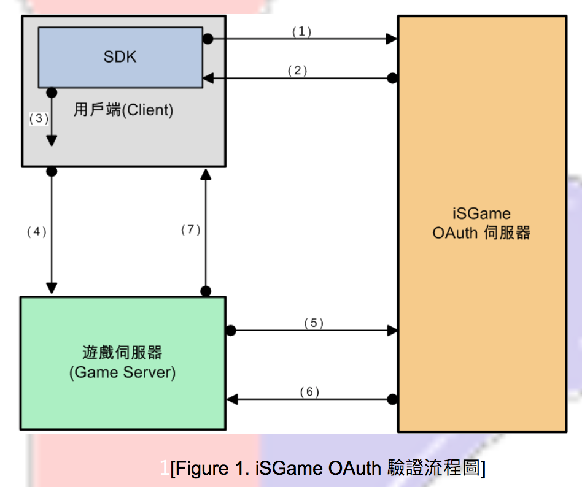

#3.登入介接
###3.1 流程說明

####3.1.1 
(1)玩家從 SDK 登入，SDK 向 iSGame OAuth 伺服器請求授權。 
(2)iSGame OAuth 伺服器回傳授權碼(code)給 SDK。 
(3)SDK 將 code 傳給用戶端(Client)。 
請按照 3.2 與 SDK 介接方法進行實作。

####3.1.2 
(4)用戶端將 code 傳回遊戲伺服器(Game Server)。  (*傳遞方法由貴方自行完成)

####3.1.3 
(5)遊戲伺服器向 iSGame OAuth 伺服器驗證 code。  
(6)驗證成功後，iSGame OAuth 伺服器回傳登入金鑰(relogin key)、 平台 uid 等參數給遊戲伺服器。 
請按照 3.3 與 iSGame OAuth 伺服器介接方法進行實作。

####3.1.4 
(7)遊戲伺服器將 relogin key 存至遊戲用戶端。  
(*儲存方法由貴方自行完成，relogin key 應在下次登入時帶入 SDK)

***

###3.2 與 SDK 介接方法
####3.2.1 
>在需要 SDK 功能的檔案添加 iSGameSDK。 

`#import <iSGameSDK/iSGameSDK.h>`

####3.2.2 
>編輯 AppDelegate.m 檔，實作`<UIApplicationDelegate>`協定。

-(BOOL) application:(UIApplication *) application didFinishLaunchingWithOptions:(NSDictionary *)launchOptions
  { 
// 設定使用 IsvDelegete 的目標 
[[LoginView sharedApplication] setDelegate:self]; 
// 設定 SDK 畫面以橫向(YES)或直向(NO)顯示;預設為 YES 
[[LoginView sharedApplication] setIsLandscape:YES]; 
// 設定 SDK 介面以繁體中文(zh_TW)或英文(en)顯示;預設為系統語系(非中則英)  
[[LoginView sharedApplication] setLocalize:@"zh_TW"]; 
//設定iSGameclient_id和redirect_uri 
[[LoginView sharedApplication] init:@"xxx" redirectUri:@"xxx"]; 
// 提供給FB與AF SDK使用 
return [[LoginView sharedApplication] application:application
                    didFinishLaunchingWithOptions:launchOptions]; 
 }
 
<a href="right.htm" target="right">回首頁</a>

